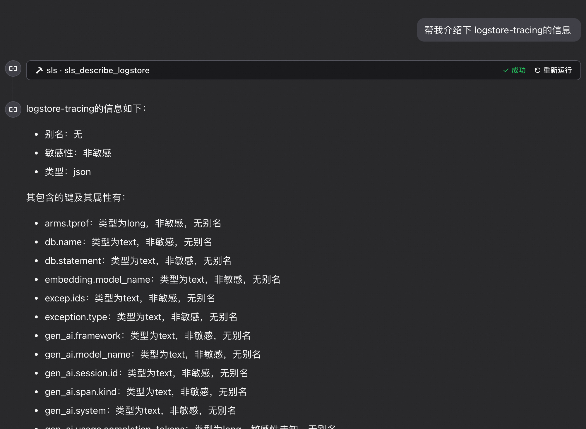
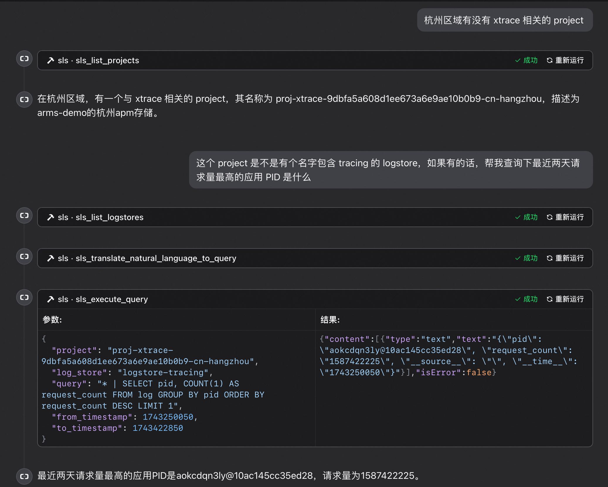
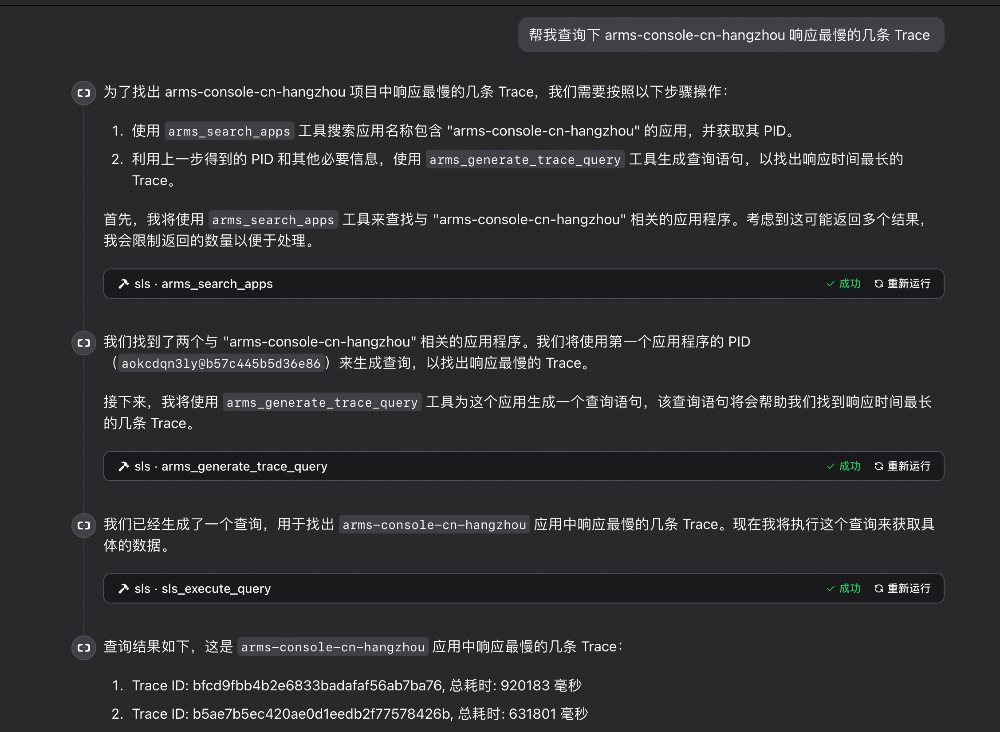

> 注：当前项目为 Serverless Devs 应用，由于应用中会存在需要初始化才可运行的变量（例如应用部署地区、函数名等等），所以**不推荐**直接 Clone 本仓库到本地进行部署或直接复制 s.yaml 使用，**强烈推荐**通过 `s init ${模版名称}` 的方法或应用中心进行初始化，详情可参考[部署 & 体验](#部署--体验) 。

# start-mcp-server-aliyun-observability 帮助文档

<description>

阿里云可观测服务 Observable MCP Server 模版

</description>


## 资源准备

使用该项目，您需要有开通以下服务并拥有对应权限：

<service>


| 服务/业务 |  权限  | 相关文档 |
| --- |  --- | --- |
| 函数计算 |  AliyunFCFullAccess | [帮助文档](https://help.aliyun.com/product/2508973.html) [计费文档](https://help.aliyun.com/document_detail/2512928.html) |

</service>

<remark>


</remark>

<disclaimers>


</disclaimers>

## 部署 & 体验

<appcenter>
   
- :fire: 通过 [云原生应用开发平台 CAP](https://cap.console.aliyun.com/template-detail?template=start-mcp-server-aliyun-observability) ，[](https://cap.console.aliyun.com/template-detail?template=start-mcp-server-aliyun-observability) 该应用。
   
</appcenter>
<deploy>
    
   
</deploy>

## 案例介绍

<appdetail id="flushContent">

### 简介

阿里云可观测 MCP服务，提供了一系列访问阿里云可观测各产品的工具能力，覆盖产品包含阿里云日志服务SLS、阿里云应用实时监控服务ARMS、阿里云云监控等，任意支持 MCP 协议的智能体助手都可快速接入。支持的产品如下:

- [阿里云日志服务SLS](https://help.aliyun.com/zh/sls/product-overview/what-is-log-service)
- [阿里云应用实时监控服务ARMS](https://help.aliyun.com/zh/arms/?scm=20140722.S_help@@%E6%96%87%E6%A1%A3@@34364._.RL_arms-LOC_2024NSHelpLink-OR_ser-PAR1_215042f917434789732438827e4665-V_4-P0_0-P1_0)

### 权限要求

为了确保 MCP Server 能够成功访问和操作您的阿里云可观测性资源，您需要配置以下权限：

1.  **阿里云访问密钥 (AccessKey)**：
    *   服务运行需要有效的阿里云 AccessKey ID 和 AccessKey Secret。
    *   获取和管理 AccessKey，请参考 [阿里云 AccessKey 管理官方文档](https://help.aliyun.com/document_detail/53045.html)。
  
2. 当你初始化时候不传入 AccessKey 和 AccessKey Secret 时，会使用[默认凭据链进行登录](https://www.alibabacloud.com/help/zh/sdk/developer-reference/v2-manage-python-access-credentials#62bf90d04dztq)
   1. 如果环境变量 中的ALIBABA_CLOUD_ACCESS_KEY_ID 和 ALIBABA_CLOUD_ACCESS_KEY_SECRET均存在且非空，则使用它们作为默认凭据。
   2. 如果同时设置了ALIBABA_CLOUD_ACCESS_KEY_ID、ALIBABA_CLOUD_ACCESS_KEY_SECRET和ALIBABA_CLOUD_SECURITY_TOKEN，则使用STS Token作为默认凭据。
   
3.  **RAM 授权 (重要)**：
    *   与 AccessKey 关联的 RAM 用户或角色**必须**被授予访问相关云服务所需的权限。
    *   **强烈建议遵循"最小权限原则"**：仅授予运行您计划使用的 MCP 工具所必需的最小权限集，以降低安全风险。
    *   根据您需要使用的工具，参考以下文档进行权限配置：
        *   **日志服务 (SLS)**：如果您需要使用 `sls_*` 相关工具，请参考 [日志服务权限说明](https://help.aliyun.com/zh/sls/overview-8)，并授予必要的读取、查询等权限。
        *   **应用实时监控服务 (ARMS)**：如果您需要使用 `arms_*` 相关工具，请参考 [ARMS 权限说明](https://help.aliyun.com/zh/arms/security-and-compliance/overview-8?scm=20140722.H_74783._.OR_help-T_cn~zh-V_1)，并授予必要的查询权限。
    *   请根据您的实际应用场景，精细化配置所需权限。

### 安全与部署建议

请务必关注以下安全事项和部署最佳实践：

1.  **密钥安全**：
    *   本 MCP Server 在运行时会使用您提供的 AccessKey 调用阿里云 OpenAPI，但**不会以任何形式存储您的 AccessKey**，也不会将其用于设计功能之外的任何其他用途。

2.  **访问控制 (关键)**：
    *   当您选择通过 **SSE (Server-Sent Events) 协议** 访问 MCP Server 时，**您必须自行负责该服务接入点的访问控制和安全防护**。
    *   **强烈建议**将 MCP Server 部署在**内部网络或受信环境**中，例如您的私有 VPC (Virtual Private Cloud) 内，避免直接暴露于公共互联网。
    *   推荐的部署方式是使用**阿里云函数计算 (FC)**，并配置其网络设置为**仅 VPC 内访问**，以实现网络层面的隔离和安全。
    *   **注意**：**切勿**在没有任何身份验证或访问控制机制的情况下，将配置了您 AccessKey 的 MCP Server SSE 端点暴露在公共互联网上，这会带来极高的安全风险。

##### 工具列表
目前提供的 MCP 工具以阿里云日志服务为主，其他产品会陆续支持，工具详细如下(具体以实际版本支持为主):
- 增加 SLS 日志服务相关工具
    - `sls_describe_logstore`
        - 获取 SLS Logstore 的索引信息
    - `sls_list_projects`
        - 获取 SLS 项目列表
    - `sls_list_logstores`
        - 获取 SLS Logstore 列表
    - `sls_describe_logstore`
        - 获取 SLS Logstore 的索引信息
    - `sls_execute_query`
        - 执行SLS 日志查询
    - `sls_translate_natural_language_to_query`
        - 翻译自然语言为SLS 查询语句

- 增加 ARMS 应用实时监控服务相关工具
    - `arms_search_apps`
        - 搜索 ARMS 应用
    - `arms_generate_trace_query`
        - 根据自然语言生成 trace 查询语句

##### 场景举例

- 场景一: 快速查询某个 logstore 相关结构
    - 使用工具:
        - `sls_list_logstores`
        - `sls_describe_logstore`
    


- 场景二: 模糊查询最近一天某个 logstore下面访问量最高的应用是什么
    - 分析:
        - 需要判断 logstore 是否存在
        - 获取 logstore 相关结构
        - 根据要求生成查询语句(对于语句用户可确认修改)
        - 执行查询语句
        - 根据查询结果生成响应
    - 使用工具:
        - `sls_list_logstores`
        - `sls_describe_logstore`
        - `sls_translate_natural_language_to_query`
        - `sls_execute_query`
    

    
- 场景三: 查询 ARMS 某个应用下面响应最慢的几条 Trace
    - 分析:
        - 需要判断应用是否存在
        - 获取应用相关结构
        - 根据要求生成查询语句(对于语句用户可确认修改)
        - 执行查询语句
        - 根据查询结果生成响应
    - 使用工具:
        - `arms_search_apps`
        - `arms_generate_trace_query`
        - `sls_translate_natural_language_to_query`
        - `sls_execute_query`
    


#### 工具集成

> 以 SSE 启动方式为例,transport 端口为 8888,实际使用时需要根据实际情况修改

#### Cursor，Cline 等集成
1. 使用 SSE 启动方式
```json
{
  "mcpServers": {
    "alibaba_cloud_observability": {
      "url": "http://localhost:7897/sse"
        }
  }
}
```
2. 使用 stdio 启动方式
   直接从源码目录启动,注意
    1. 需要指定 `--directory` 参数,指定源码目录，最好是绝对路径
    2. uv命令 最好也使用绝对路径，如果使用了虚拟环境，则需要使用虚拟环境的绝对路径
```json
{
  "mcpServers": {
    "alibaba_cloud_observability": {
      "command": "uv",
      "args": [
        "--directory",
        "/path/to/your/alibabacloud-observability-mcp-server",
        "run",
        "mcp-server-aliyun-observability"
      ],
      "env": {
        "ALIBABA_CLOUD_ACCESS_KEY_ID": "<your_access_key_id>",
        "ALIBABA_CLOUD_ACCESS_KEY_SECRET": "<your_access_key_secret>"
      }
    }
  }
}
```
1. 使用 stdio 启动方式-从 module 启动
```json
{
  "mcpServers": {
    "alibaba_cloud_observability": {
      "command": "uv",
      "args": [
        "run",
        "mcp-server-aliyun-observability"
      ],
      "env": {
        "ALIBABA_CLOUD_ACCESS_KEY_ID": "<your_access_key_id>",
        "ALIBABA_CLOUD_ACCESS_KEY_SECRET": "<your_access_key_secret>"
      }
    }
  }
}


